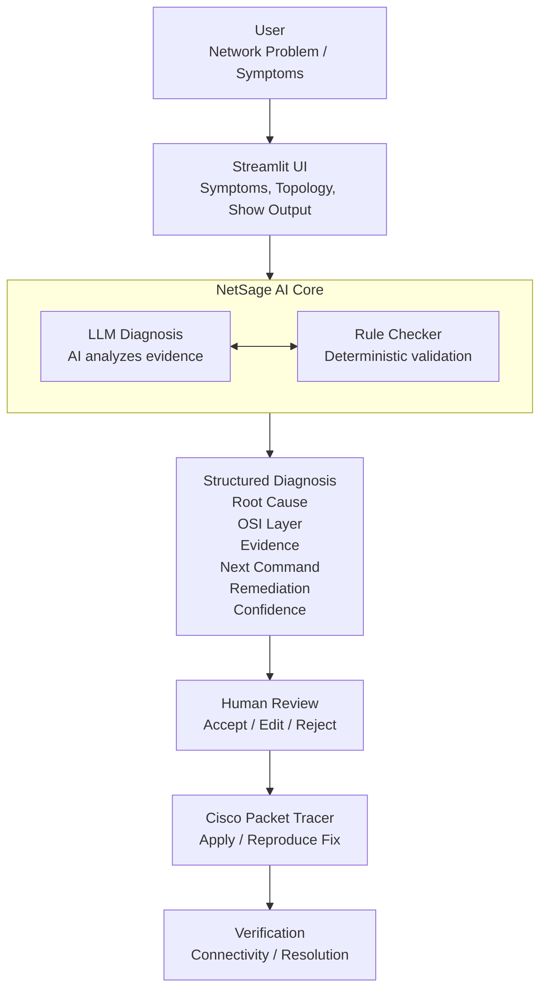
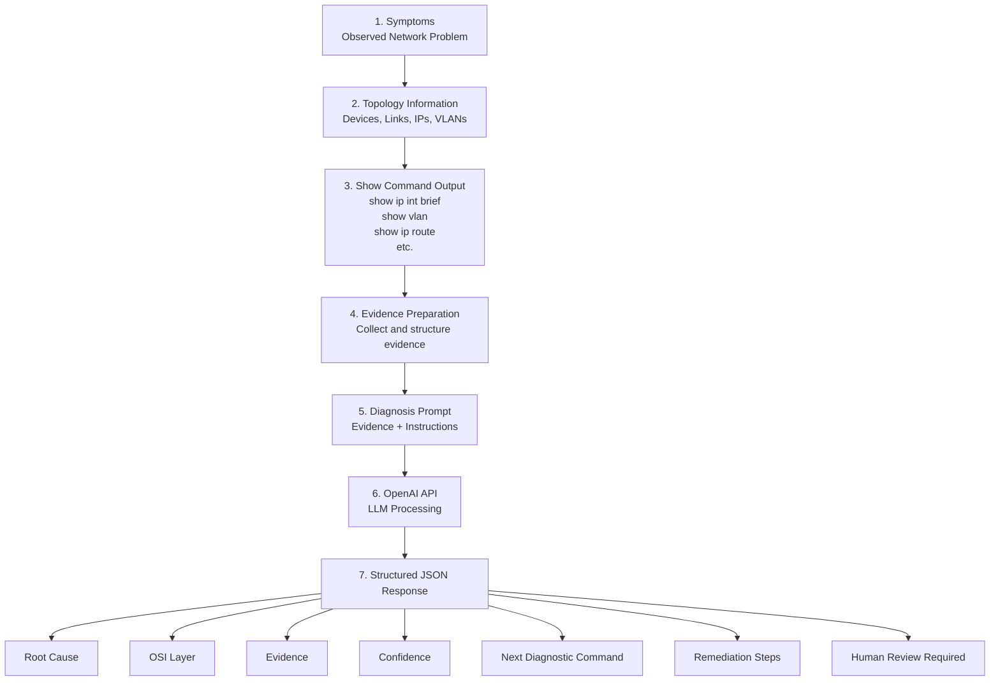
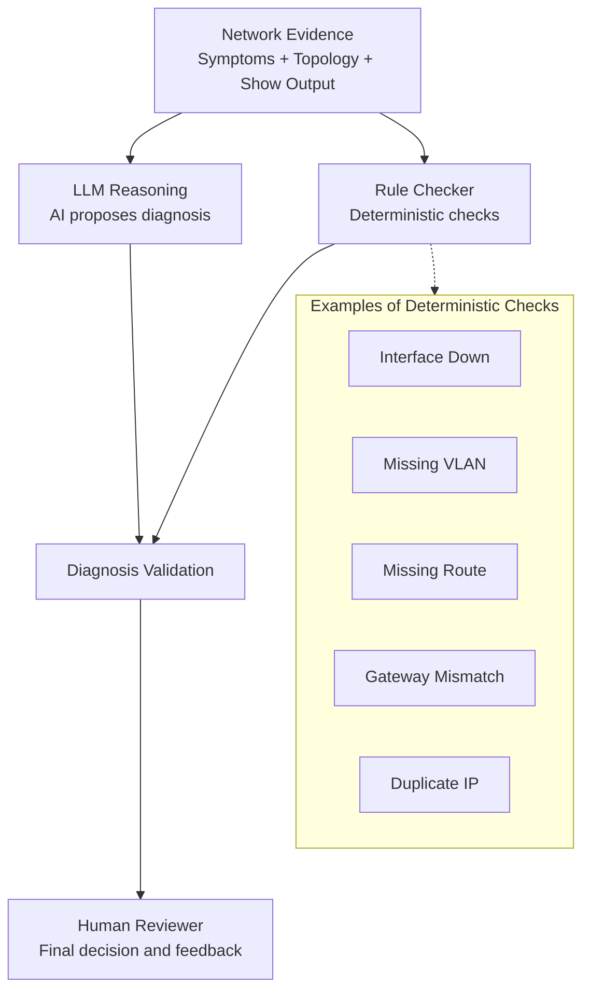
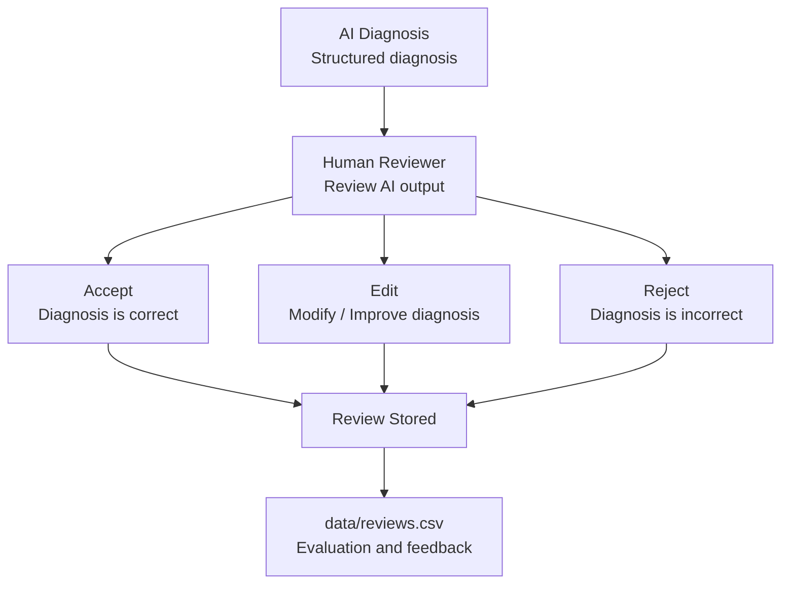
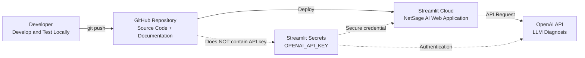
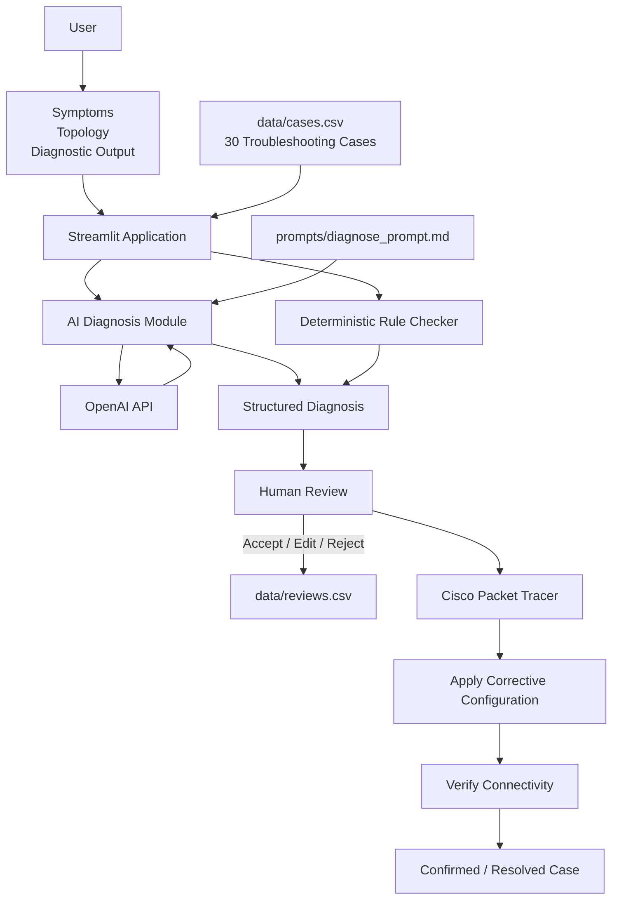

# NetSage AI — System Architecture Diagrams

This document contains the major architecture diagrams of the NetSage AI system. The diagrams use Mermaid syntax and can be viewed directly on GitHub or in Markdown editors that support Mermaid.

---

## 1. High-Level System Architecture



---

## 2. AI Diagnosis Pipeline



---

## 3. Hybrid AI + Rule Checker Architecture



---

## 4. Human-in-the-Loop Architecture



---

## 5. Deployment Architecture



---

## 6. Complete End-to-End Architecture



---

## 7. Architecture Components

| Component | Responsibility |
|---|---|
| Streamlit UI | User interaction and presentation |
| AI Diagnosis Module | Sends evidence to the LLM and processes the response |
| OpenAI API | Provides LLM-based reasoning |
| Rule Checker | Performs deterministic checks for common faults |
| Structured Diagnosis | Standardizes AI output |
| Human Review | Accepts, edits, or rejects the diagnosis |
| `cases.csv` | Stores the 30 troubleshooting cases |
| `reviews.csv` | Stores human review information |
| Packet Tracer | Reproduces and verifies network faults |
| GitHub | Source-code version control |
| Streamlit Cloud | Hosts the deployed application |
| Streamlit Secrets | Securely stores the OpenAI API key |

---

## 8. Overall Design Principle

NetSage AI follows the principle:

```text
Evidence
   ↓
AI Reasoning
   +
Deterministic Validation
   ↓
Structured Diagnosis
   ↓
Human Review
   ↓
Packet Tracer Verification
   ↓
Final Troubleshooting Decision
```

The system does **not** allow the AI to automatically modify network configurations. Human oversight remains part of the final troubleshooting workflow.
